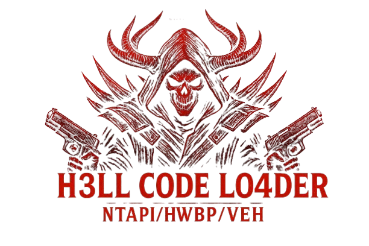

  

<h1 align="center">🔥 Hell Code Loader 🔥</h1>

<em>“Stealthy shellcode injection using not-so-new evasion techniques on Windows.”</em>

---

> **DISCLAIMER!**  
> This project was developed **for educational purposes only** in a controlled environment.  
> **Do not use it in production environments** or on systems/infrastructures that you do not own, or without **explicit authorization**.  
> I am not responsible for any misuse of this code.

---

## Overview

**Hell Code Loader** is a lightweight proof-of-concept tool for **injecting and executing shellcode** on **Windows** systems with "minimal" detection. It leverages indirect NT syscalls, hardware breakpoints, VEH, and other evasive tactics.

---

## Features

> *“I know there are better ways to apply this, but I follow a simple logic: if it works for me, that's what matters.”*

1. **Indirect NTAPI Syscalls**  
   - Bypass user-mode API hooks.
2. **AsmHalosGate**  
   - Resolution of syscall service numbers (SSNs) in NTDLL.  
3. **Hardware Breakpoints (HWBP)**  
   - Place breakpoints on `AmsiScanBuffer` and `NtTraceEvent` for on-the-fly patching.  
4. **Thread-Pool DLL Loading**
5. **RC4 Payload Decryption**
6. **Vectored Exception Handling (VEH)**
   - Redirecting the VEH handler's RIP to execute shellcode.
---

## Evasion Results
*Historically it has been able to bypass the following list of antivirus/edr:*
> **Note:**  
> - This can't be considered a 100% bypass since I only tested it by running Mimikatz commands! 
> - In a properly configured EDR environment, things are different!
> - This ranking list was generated by AI, so I can't guarantee the data is 100% accurate :)
>
> | Antivirus                                 | Ranking            | 2024 AV-Comparatives Recognition           |
> |-------------------------------------------|--------------------|---------------------------------------------|
> | [ESET HOME Security Essential](https://www.eset.com/)    | 🥇 1st place       | Product of the Year 2024                    |
> | [Sophos Endpoint](https://www.sophos.com)               | 🥈 2nd place       | Approved Enterprise & Business Security     |
> | [Bitdefender Endpoint Security](https://www.bitdefender.com) | 🥉 3rd place       | Approved Enterprise & Business Security     |
> | [Trend Micro Max Security](https://www.trendmicro.com)     | 4th place          | Top-Rated Product 2024                     |
> | [Bitdefender Total Security](https://www.bitdefender.com)  | 5th place          | Top-Rated Product 2024                     |
> | [Avira Antivirus Pro](https://www.avira.com)             | 6th place          | Approved Security Product 2024             |
> | [Malwarebytes Standard](https://www.malwarebytes.com)     | 7th place          | Approved Security Product 2024             |
> | [TotalAV](https://www.totalav.com)                         | 8th place          | Approved Security Product 2024             |
> | [F-Secure Anti-Virus](https://www.f-secure.com)           | 9th place          | Approved Security Product 2024             |

---

## POC

- **Shellcode Execution** : [YouTube](https://www.youtube.com/watch?v=4EGTEp_hLz0)  
  Executed Mimikatz shellcode (converted via [donut](https://github.com/TheWover/donut)) without AV detection.

- **DLL Proxy + Hell Code Loader** : [YouTube](https://www.youtube.com/watch?v=K0fJ3RusIb8)  
  To bypass Bitdefender Total Security and Endpoint Security, I had to implement loader injection through a DLL proxy.

---

## Credits & References

- Influenced by various GitHub projects and community research 🗿  
- [Awesome Malware Blogs](https://github.com/Vith0r/Awesome-Malware-Blogs) 🦐 